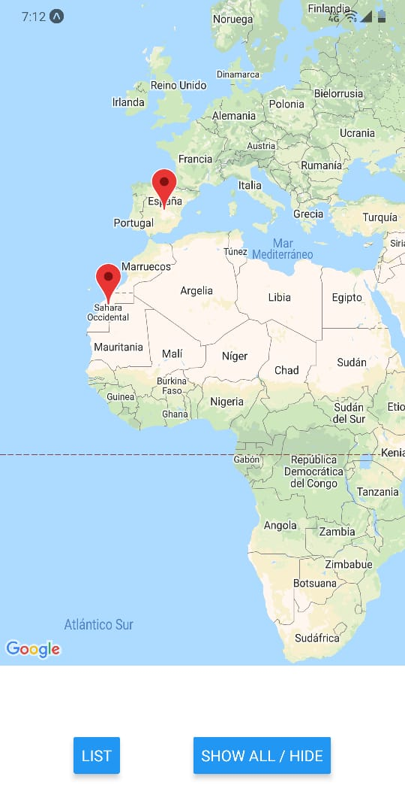
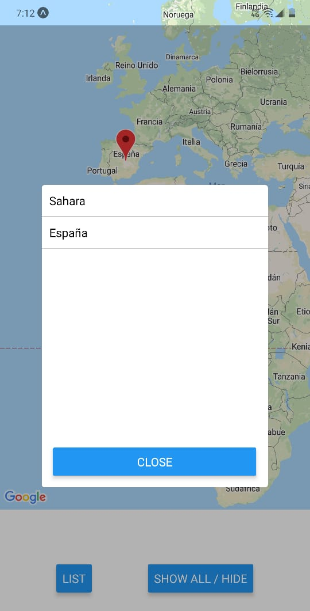
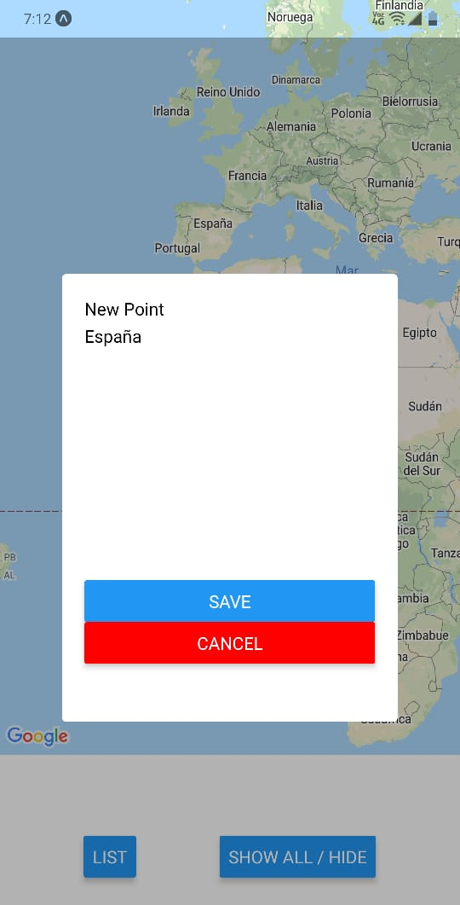

# reactNative-app_mapsMarkers

this is a simple map app, with the next components: 
 * point 
 * last list
 * modal
 * buttons
 * others!
 
 Snaps: 
 1. Maps with markers:
 

 2. List of points:
 

 3. Add a new point:
 

  
This examples are part from the [react-native sin fronteras](https://www.udemy.com/course/react-native-sin-fronteras/) course

